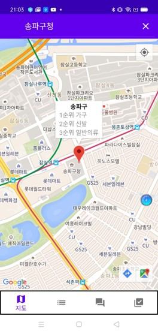

# KSB BeeAI Project
_공공 데이터를 기반으로 한 창업성 평가_
  

## KSB Project
본 프로젝트는 2020년도 KSB BeeAI 공모전 최우수상을 수상한 프로젝트입니다.

본 프로젝트의 목적은 국내 저조한 창업 생존율(2018년도 기준 27.5%)과 적은 창업 준비기간(평균 6개월 미만)을 개선하기 위하여 진행된 프로젝트입니다. 목적은 예비 창업자에게 객관적이고 유리한 업종을 추천해주는 것을 목표로 합니다.  

DataSet : 공공데이터 이용 
Tool : Android Studio, Jupyter NoteBook(Python), BeeAI platform 
Technology : MQTT 통신, TCP 소켓 통신, Random Forest
  

## BeeAI X Android App

## A.I Unicorn App의 기능
### Main 기능
|                    창업 카테고리 추천                   |                    추천 카테고리 분석                   |
|:-------------------------------------------------------:|:-------------------------------------------------------:|
|  |  |
 
 

### Sub 기능
|         사용자 옵션지정 결과 표시         |                   MQTT 실시간 처리                  |
|:-----------------------------------------:|:---------------------------------------------------:|
|  |  |

 

|            문의사항 메일            |
|:-----------------------------------:|
|  |

   

_Contact :_ &nbsp; 

